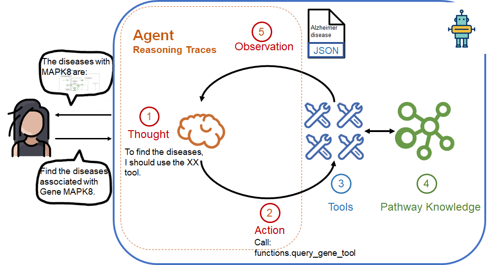
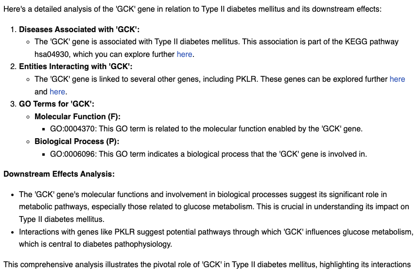

# Pathway Analysis Assistant: PathwayGenie


Meet **PathwayGenie**, a assistant for pathway and disease hypothesis generation.

PathwayGenie leverages Neo4j and OpenAI to answer complex biological questions like:
- What diseases is gene X associated with?
- what are the entities interact with Gene SOCS4?
- Analyze the cascade downstream effects of 'GCK' on Type II diabetes mellitus.



## Prerequisites
- Python 3.12 or later
- Neo4j
- OpenAI API access
---

## Setup Instructions

### Step 1: Prepare Data
1. Download the **Gene Association File (GAF)** for Homo sapiens from the [Gene Ontology Downloads](https://current.geneontology.org/products/pages/downloads.html).
2. Place the file under the `data/` folder.

### Step 2: Configure Environment
Create a `.env` file in the root directory:
```env
NEO4J_URI=bolt://
NEO4J_PASSWORD=1111
NEO4J_NAME=db_name
```
1. Replace NEO4J_PASSWORD with your Neo4j password.
2. Update NEO4J_NAME to the database name.

### Step 3: Install Dependencies
Run the following command in the root directory to install required Python packages:
```env
pip install -r requirements.txt
```

### Step 4: Initialize Database
Run the following script to process the data and populate the Neo4j database:
```env
python scripts/main_init.py
```
### Step 5: Run the Agent
Run the PathwayGenie agent using the following command:
```env
python pathway_analysis_agent/main_agent.py
```
---
##  Directory Structure
```env
pathways_analysis/
├── pathway_analysis_agent/    # Agent-related scripts
├── scripts/                   # Database initialization scripts
├── data/                      # Input data KGML and GAF files
├── assets/
├── langgraph.json             # Config for Local LangGraph Server (optional)
├── requirements.txt           # Python dependencies
├── .env                       # Environment variables
```
---
##  Optional Setup
### Launch Local LangGraph Server
Use the langgraph.json file to launch a [local LangGraph server](https://langchain-ai.github.io/langgraph/tutorials/langgraph-platform/local-server/).
Refer to the LangGraph Tutorial for setup instructions.
### Debugging with LangSmith
Use the [LangSmith Debugging Platform](https://docs.smith.langchain.com/) for enhanced debugging capabilities.

---

## Example Output

Here’s an example output generated by PathwayGenie based on a query about gene-disease associations:

